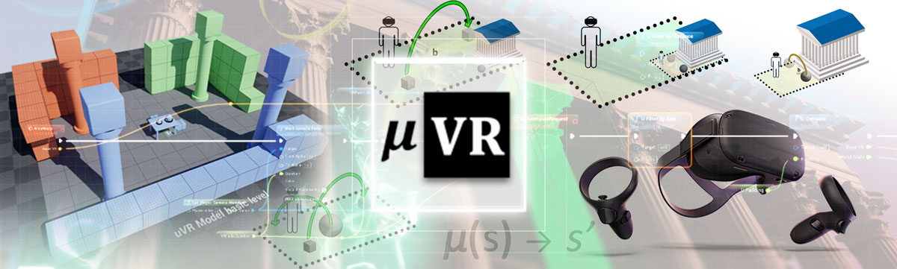

# μVR Model
  
[Project Site](http://osiris.itabc.cnr.it/scenebaker/index.php/projects/uvr/)

The μVR model (B. Fanini, CNR ISPC) combines **real-walking** techniques and an adaptive, **multi-scale** gameplay to craft immersive *re-contextualization* applications and 3D puzzles. The model aims to remove/minimize motion sickness while fully exploiting the physical tracked area available.
You can find the open-access article (2018) [here on Multimodal Technologies and Interaction journal](http://www.mdpi.com/2414-4088/2/2/20). Here is the bibtex to cite our research project.
```
@article{fanini2018uVR,
    title={A Novel Immersive VR Game Model for Recontextualization in Virtual Environments: The $\mu$VR Model},
    journal={Multimodal Technologies and Interaction},
    author={Bruno Fanini and Alfonsina Pagano and Daniele Ferdani},
    doi={10.3390/mti2020020},
    url={http://doi.org/10.3390/mti2020020},
    year={2018}
}
```


The very first goal of the μVR Model (and 3D puzzles/applications created on top of it) is to completely remove artificial locomotion techniques (e.g., teleport) by instead exploiting the *physical tracked area* and **real walking** techniques combined with game state and world scale.

## Template project
The template project provides you a VR-ready setup with a sample 3D scene and open-source plugin (C++ and Blueprints) to create your own μVR levels and games.


## Getting started
soon.

