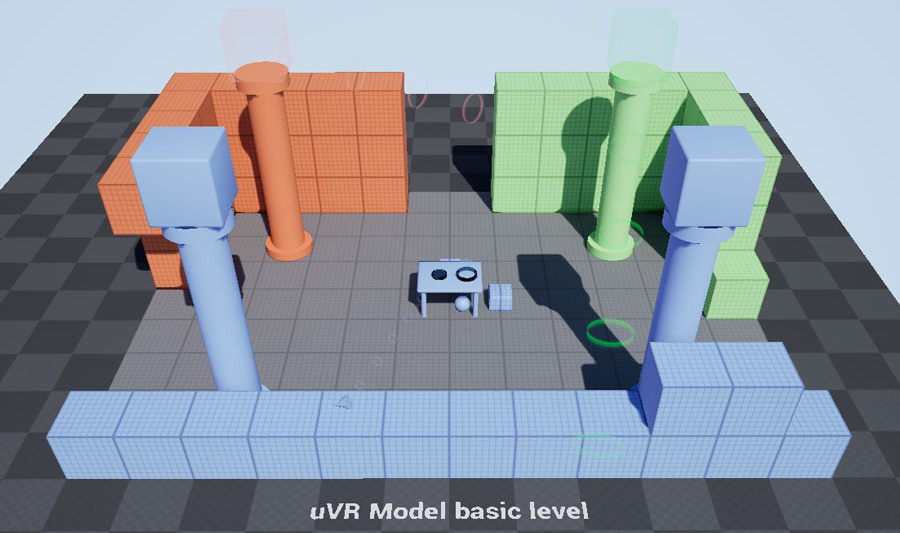

# μVR Model

[Project Site](http://osiris.itabc.cnr.it/scenebaker/index.php/projects/uvr/)

The μVR model combines real-walking techniques and an adaptive, game-driven, multi-scale progression to craft immersive re-contextualization applications. The presented model aims to minimize motion sickness while fully exploiting the physical tracked area. You can find the open-access article (2018) [here on Multimodal Technologies and Interaction journal](http://www.mdpi.com/2414-4088/2/2/20).

## Template project for Unreal Engine 4

The template project provides you a VR-ready setup with a sample 3D scene and open-source plugin (C++ and Blueprints) to create your own μVR game.